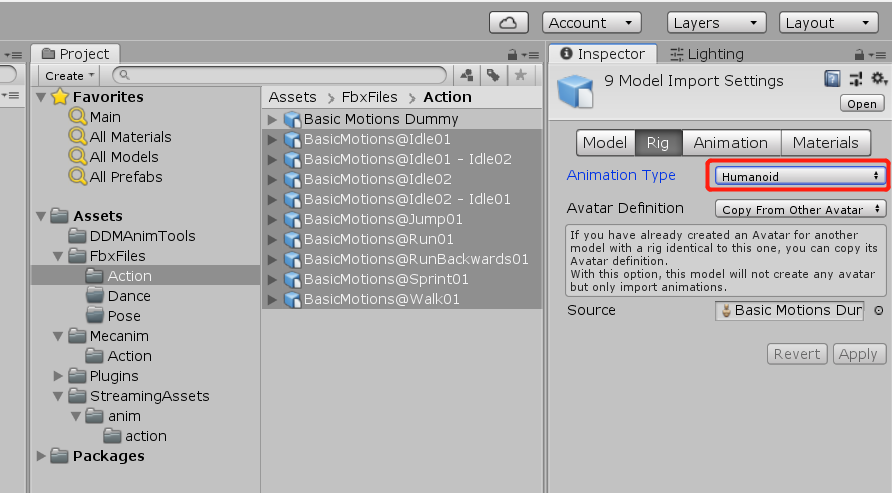
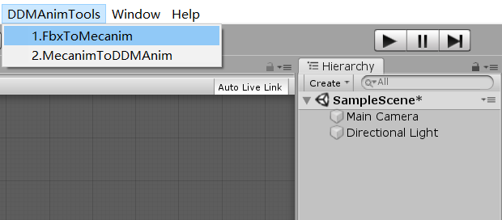

# DDMAnimTools 
Unity project helps convert FBX animations into DDM(Dance Dance Maker!) Animations  
1.Install Unity 2018.4.X 
2.Open this project in Unity 2018.4.X 
3.Copy the Fbx files to "Assets/FbxFiles" sub folder,for example,copy fbx to "Action" sub folder: 
 
4.Make sure animation type is "Humanroid" 
 
5.Press Menu "DDMAnimTools/FbxToMecanim",to convert FBX to unity Mecanims: 
 
6.Now you have mecanims in "Mecanim" sub folder: 
 
7.Press Menu "DDMAnimTools/MecanimToDDMAnim" to convert unity Mecanims to DDM animations: 
 
8.After a while you should see this under "StreamAssets" folder: 
 
9.That is the anim files can be used in DDM,you can copy them to sdcard for example: 
adb push *.anim /sdcard/ 
then load anim use DDM animation file dialog.
